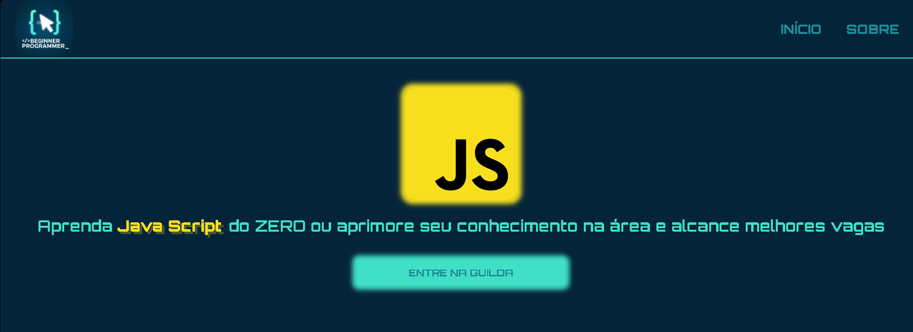

# Begginer Programming

## 📌 Descrição
O Beginner Programming é um projeto criado para ajudar iniciantes na programação, promovendo aprendizado colaborativo e troca de conhecimento.
O que começou como um simples grupo de conversa evoluiu para uma comunidade, onde pessoas com diferentes níveis de experiência se ajudam a crescer.
Embora ainda não sejamos uma comunidade grande, estamos em constante crescimento e desenvolvimento.

## 🛠️ Tecnologias

- HTML
- CSS
- JavaScript
- React.js
- GIT


## 🚀 Features

- Código organizado e de fácil manutenção
- Layout focado em boa experiência do usuário (UX)
- Estrutura escalável para novos projetos
- Uso de boas práticas de JavaScript
- Organização em pastas e arquivos
- Padronização de nomes e funções
- Design responsivo
- Tipografia e cores organizadas

## 📷 Preview



## 🔗 Link

https://begginerprogramming.netlify.app

## 📂 Como rodar

```bash
npm run dev
```
